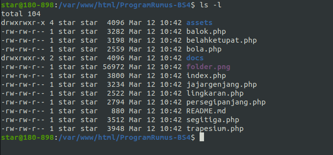
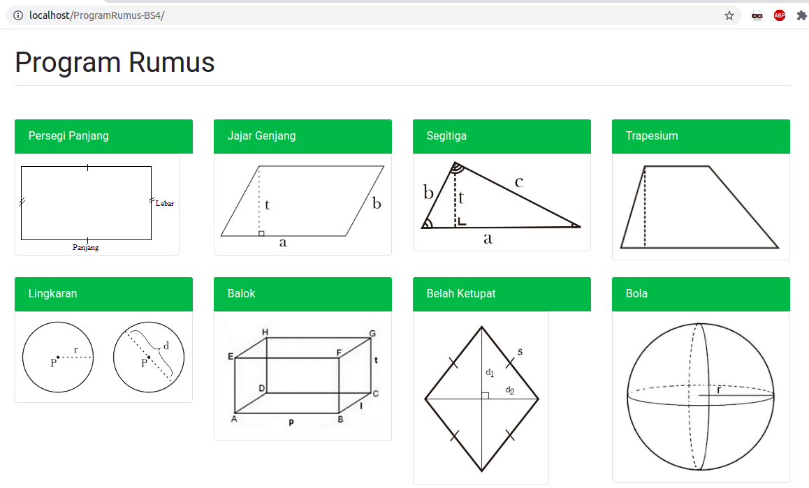
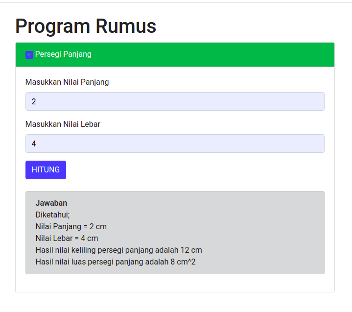

# ProgramRumus

<b>Belajar Framework Bootstrap 4.6x</b>

Bootstrap merupakan sebuah library framework CSS yang telah dibuat khusus uintuk mengembangkan front end sebuah website. Bootstrap juga dikenal sebagai salah satu framework CSS, HTML, Javascript yang begitu populer di kalangan website developer atau pengembang website.

Penerapan bootstrap dengan kasus menghitung nilai bangun datar dan bangun ruang.

<b>Peralatan Yang Digunakan</b> 
1. Web Server atau XAMPP
2. Aplikasi Text Editor(Visual Studio Code)
3. <a href="https://getbootstrap.com/">Bootstrap 4.6x </a>

<b>Langkah Kerja</b> 
Anda dapat langsung menggunakan program diatas dengan cara:
<blockquote class="tr_bq">
Download file program&nbsp;</blockquote>
<blockquote class="tr_bq">
Pindahkan folder program ke html(LAMP) atau htdocs(XAMPP)&nbsp;</blockquote>

<blockquote class="tr_bq">
Jalankan program di browser anda(localhost/ProgramRumus-BS4)&nbsp;</blockquote>

Silahkan gunakan program ini sebagai pembelajaran dan untuk belajar lebih mendalam tentang Bootstrap silahkan kunjungi dokumentasi pada web resmi bootstrap 
Dokumentasi Bootstrap Link : https://getbootstrap.com/docs/4.6/getting-started/introduction/

